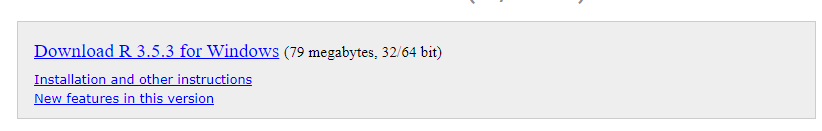

## Install Older Package from Source  

[R Studio Support - Installing older versions of packages](https://support.rstudio.com/hc/en-us/articles/219949047-Installing-older-versions-of-packages)

[Package Archive](https://cran.r-project.org/src/contrib/Archive/ )

```
packageurl <- "https://cran.r-project.org/src/contrib/Archive/<package>/<package>_<version>.tar.gz"
install.packages(packageurl, repos=NULL, type="source")
```

## Install Older Version of R (Windows) 

If a program was built entirely in an older version of R, it may be difficult to get it to work with an updated version of R. When their isn't time to investitgate and re-code, installing an older version of R is possible.  

1. [cran.r-project.org](https://cran.r-project.org/)
1. Click the 'Download for Windows' link for your given operating system  
 
1. Click on the 'base' link   
 
1. Click on the 'Previous releases' link 
 
1. Click on the specific R version you want, say R 3.5.3 

1. Click on the 'Download R <version> for Windows' and this will download an exe file 

1. Run the exe file to install the older version of R 

## Switch between versions of R

1. Open R Studio 
1. Tools -> Global Options...
1. General -> R Version -> Change...

